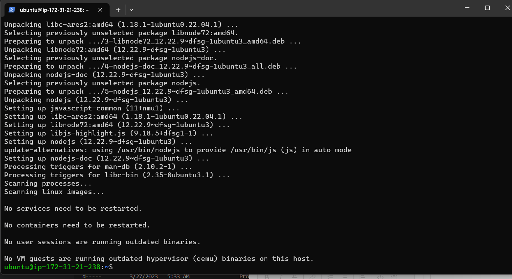

# Awesome documentation of project 4: MEAN STACK DEPLOYMENT TO UBUNTU IN AWS.

#### Mean stack deployment have to deal with the combination of the MongoDb,Express,Angular,Node.JS(Accepts request and display to web browser or end user).

### Step1: Installation of the Node.js Web Server and also the Ec2 instance.

#### Node.js is a high-performance web server and i used the apt package manager to install this package.The cmd used is the "sudo apt -get install -y nodejs"

 

 ### Step 2: Installation of Express.js was done successfully.

#### Express.Js is a server side web application which is also a framework that is been used by node.js to perform its operations. In mern stack deployment ExpressJs is been installed also in order to get optimum functionality.

 

 