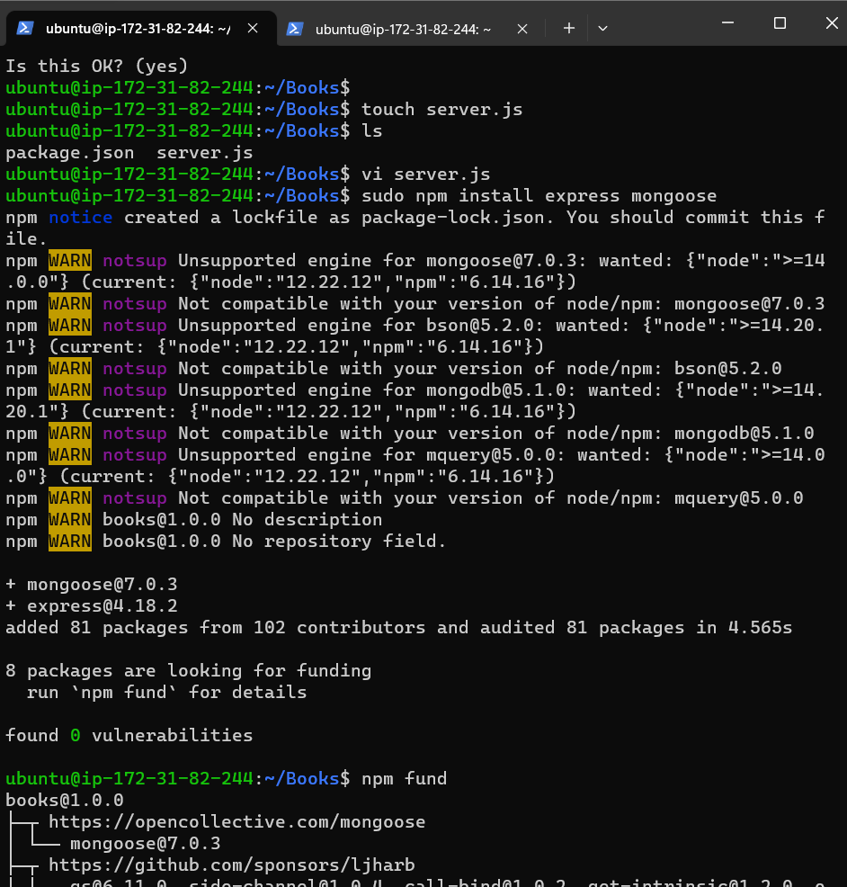
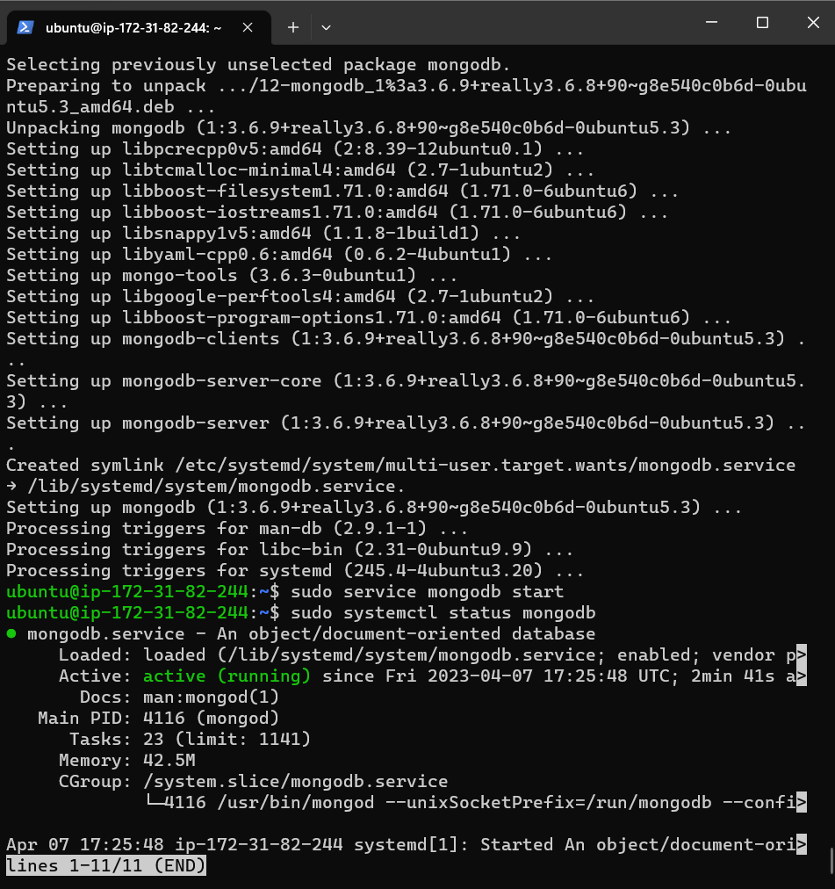
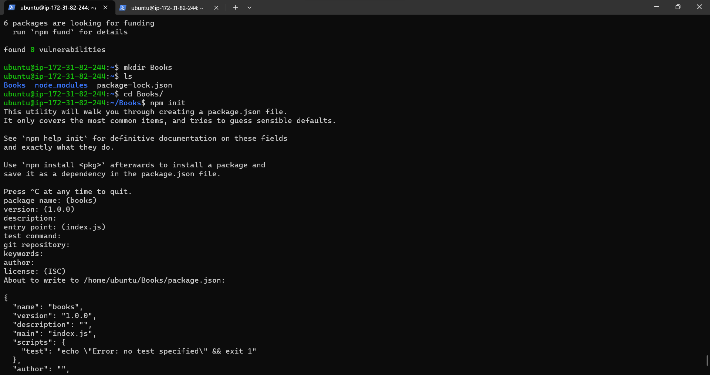
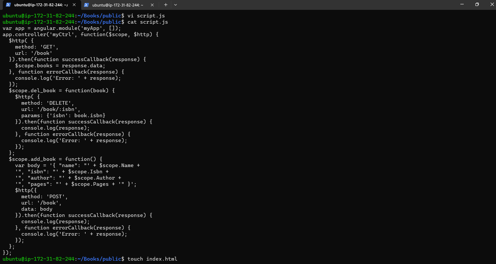
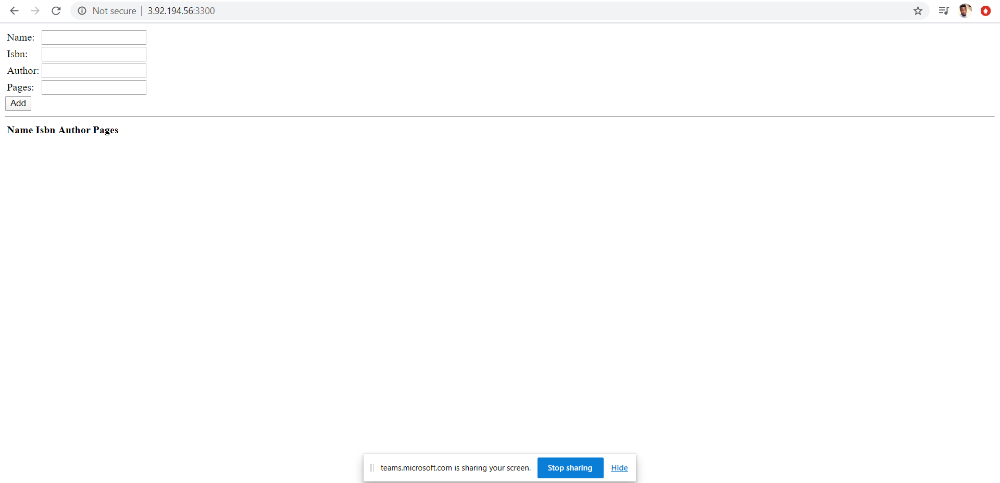

# Awesome documentation of project 4: MEAN STACK DEPLOYMENT TO UBUNTU IN AWS.

#### Mean stack deployment have to deal with the combination of the MongoDb,Express,Angular,Node.JS(Accepts request and display to web browser or end user).

### Step1: Installation of the Node.js Web Server and also the Ec2 instance.

#### Node.js is a high-performance web server and i used the apt package manager to install this package.The cmd used is the "sudo apt -get install -y nodejs"

 

 ### Step2: Installation of MongoDB Database

#### Here am using the cmd 'npm install mongoose' which was done successfully. After that i created a folder called apps here is where my routes.js file is being created which is where inserted a javascript file in it which would handing our routing functionalities. Also in the apps folder i also created a folder called model folder which contains the the book.js this would handle all the book configurations. The last file being added is the index.html, this was added to handle the frontend functionalities and what the end users is seeing.

##### mongoose installed

##### this is the confirmation of the mongodb installed.

##### created the books.js file and initialized npm package

##### Index.html file creted also for frontend.

 
 ### Step 3: Installation of Express.js was done successfully.

#### Express.Js is a server side web application which is also a framework that is been used by node.js to perform its operations. In mern stack deployment ExpressJs is been installed also in order to get optimum functionality.

 

 ### Step 3: Website launched successfully.
#### After in the index,html has been added successfully its time to test the application on the browser using the public address from the ec2 instance/ubuntu server.

##### The site is finally done and launched.

 